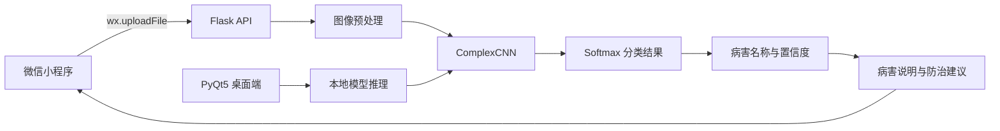

# 水稻病虫害识别系统

基于 PyTorch、PyQt5、Flask 和微信小程序实现的水稻病虫害图像识别系统。项目覆盖模型训练、桌面端推理、Backend API 和移动端交互，可根据用户上传的水稻叶片图像返回病害类别、识别置信度、严重程度、病害说明及防治建议。


## 核心功能

- 使用自定义 `ComplexCNN` 完成水稻叶片图像分类。
- 融合 Residual Block 与 SE Module，增强关键病斑特征表达。
- 提供训练、验证、测试、early stopping、学习率调度和混淆矩阵分析流程。
- 提供 PyQt5 桌面端，支持模型加载、图片选择、结果展示和摄像头预览。
- 提供 Flask REST API，接收图片并返回结构化识别结果。
- 提供微信小程序，支持拍照/相册选图、图片上传、识别结果展示和常见病害指南。
- 提供 `PyTorch -> ONNX -> TensorFlow Lite` 模型导出代码，用于后续移动端轻量化部署。

## 系统架构



主要数据链路如下：

1. 用户在微信小程序中拍照或从相册选择图片。
2. 小程序通过 `wx.uploadFile` 将图片上传至 Flask 的 `POST /api/predict`。
3. Backend 将图片转换为 RGB，缩放至 `224 x 224`，再执行 ImageNet normalization。
4. `ComplexCNN` 完成推理，并通过 Softmax 计算预测类别与置信度。
5. Backend 返回病害名称、严重程度、病害描述、防治建议和结果图片地址。
6. 小程序解析 JSON，并将识别结果转化为用户可直接理解的农业防治信息。

## 技术栈

| 模块 | 技术 |
| --- | --- |
| 模型训练 | Python、PyTorch、Torchvision、NumPy |
| 图像处理 | Pillow、OpenCV |
| 模型评估 | scikit-learn、Matplotlib、tqdm |
| 桌面应用 | PyQt5 |
| Backend | Flask、Flask-CORS |
| 移动端 | 微信小程序原生框架（WXML、WXSS、JavaScript） |
| 模型转换 | ONNX、onnx-tf、TensorFlow Lite |

## 模型设计

### ComplexCNN

模型结构由以下部分组成：

- 初始卷积模块：两层 `3 x 3` convolution、Batch Normalization、ReLU 和 MaxPooling。
- 四组 Residual Block：通道数按照 `32 -> 64 -> 128 -> 256 -> 512` 递增，block 数量分别为 `2 / 2 / 3 / 3`。
- SE Module：通过全局平均池化和通道权重重标定，突出病斑纹理、颜色与形态特征。
- 自适应池化：使用 `AdaptiveAvgPool2d((1, 1))` 将不同空间尺寸的特征映射为固定长度向量。
- 分类头：两层全连接结构配合 Batch Normalization、ReLU 和 Dropout，输出最终类别概率。

### 数据处理与训练策略

- 输入尺寸：`224 x 224`。
- 数据增强：随机裁剪、水平/垂直翻转、旋转、颜色扰动、安全色调调整、仿射变换和随机灰度化。
- 标准化：ImageNet mean `[0.485, 0.456, 0.406]`，std `[0.229, 0.224, 0.225]`。
- 数据划分：训练集、验证集和测试集比例为 `7:2:1`。
- 损失函数：`CrossEntropyLoss`。
- 优化器：`AdamW`，默认 learning rate 为 `0.001`，weight decay 为 `0.0001`。
- 调度器：`CosineAnnealingWarmRestarts`，`T_0=10`、`T_mult=2`、`eta_min=1e-6`。
- 训练控制：默认训练 50 epochs，并使用 patience 为 10 的 early stopping。
- 设备支持：自动选择 CUDA 或 CPU；检测到多张 GPU 时可使用 `DataParallel`。

## 支持的识别类别

当前 Flask 推理接口配置了 9 个类别：

| 英文类别 | 中文说明 |
| --- | --- |
| `Bacterial Leaf Blight` | 水稻白叶枯病 |
| `Brown Spot` | 水稻胡麻斑病 |
| `Healthy Rice Leaf` | 健康水稻叶片 |
| `Leaf Blast` | 叶瘟 |
| `Leaf scald` | 叶鞘腐败/叶片灼伤类病害 |
| `Narrow Brown Leaf Spot` | 窄褐斑病 |
| `Neck_Blast` | 穗颈瘟 |
| `Rice Hispa` | 水稻铁甲虫危害 |
| `Sheath Blight` | 纹枯病 |

类别名称由训练数据目录名决定。重新训练或替换模型时，应同步检查 `rice/app.py` 中的 `class_names`、病害说明和防治建议映射。

## 项目结构

```text
shuqishijian/
├── README.md                         # 项目说明
├── 软件说明书.pdf                    # 产品背景与操作说明
├── rice/
│   ├── main.py                       # 模型训练、验证、测试与单图预测
│   ├── main2.py                      # 增加 ONNX / TensorFlow Lite 导出流程
│   ├── window.py                     # PyQt5 桌面端
│   ├── app.py                        # 自动加载模型的 Flask API（推荐）
│   ├── app2.py                       # 支持通过 API 指定模型路径的 Flask 版本
│   ├── best_rice_model.pth           # PyTorch 模型文件
│   └── rice_model.tflite             # TensorFlow Lite 模型文件
└── rice-wx/
    ├── app.js                        # 小程序全局配置
    ├── app.json                      # 页面与窗口配置
    ├── app.wxss                      # 全局样式
    └── pages/
        ├── index/                    # 图片选择、上传、识别和结果展示
        └── logs/                     # 日志页面
```

## 环境准备

建议在 Windows 10/11 和 Python 3.10 或 3.11 环境中运行。

### 1. 创建虚拟环境

```powershell
cd D:\demo\shuqishijian\shuqishijian
python -m venv .venv
.\.venv\Scripts\Activate.ps1
python -m pip install --upgrade pip
```

如果 PowerShell 禁止执行激活脚本，可以在当前终端执行：

```powershell
Set-ExecutionPolicy -Scope Process -ExecutionPolicy Bypass
.\.venv\Scripts\Activate.ps1
```

### 2. 安装核心依赖

```powershell
pip install torch torchvision numpy pillow opencv-python matplotlib scikit-learn tqdm
pip install PyQt5 flask flask-cors
```

仅在使用 `main2.py` 导出 TensorFlow Lite 模型时安装：

```powershell
pip install onnx onnx-tf tensorflow
```

> PyTorch 的 CUDA 版本应根据本机显卡、CUDA 环境和 [PyTorch 官方安装说明](https://pytorch.org/get-started/locally/)选择。CPU 环境也可以运行，但训练速度会明显降低。

## 模型训练

`rice/main.py` 使用 `torchvision.datasets.ImageFolder` 读取数据。训练目录应按类别划分：

```text
rice/data/
├── class_a/
│   ├── image_001.jpg
│   └── image_002.jpg
├── class_b/
│   └── image_003.jpg
└── ...
```

进入 `rice/` 后运行：

```powershell
cd D:\demo\shuqishijian\shuqishijian\rice
python main.py
```

默认配置位于 `main.py` 底部：

```python
DATA_DIR = "./data"
MODEL_SAVE_PATH = "best_rice_model.pth"
BATCH_SIZE = 32
EPOCHS = 50
LEARNING_RATE = 0.001
WEIGHT_DECAY = 0.0001
GPU_ID = 0
```

训练过程会执行数据划分、模型训练、validation、early stopping、测试集评估，并将验证表现最好的模型保存为 `best_rice_model.pth`。

### 导出 TensorFlow Lite

`main2.py` 在完成训练和测试后，会继续执行以下转换流程：

```text
best_rice_model.pth -> rice_model.onnx -> rice_model.tflite
```

运行命令：

```powershell
cd D:\demo\shuqishijian\shuqishijian\rice
python main2.py
```

该步骤依赖 ONNX、onnx-tf 和 TensorFlow，实际兼容性与所安装的 Python 和依赖版本有关。

## PyQt5 桌面端

运行桌面应用：

```powershell
cd D:\demo\shuqishijian\shuqishijian\rice
python window.py
```

使用步骤：

1. 点击“加载模型”，选择 `best_rice_model.pth`。
2. 点击“选择图片”，选择待识别的水稻叶片图片。
3. 执行识别，查看病害类别、置信度、病害说明和防治建议。
4. 需要摄像头画面时，使用界面中的摄像头功能；程序通过独立 `QThread` 获取视频帧，避免阻塞主界面。

## Flask Backend

推荐使用 `rice/app.py`。该文件启动时会从当前目录自动加载 `best_rice_model.pth`。

```powershell
cd D:\demo\shuqishijian\shuqishijian\rice
python app.py
```

默认监听：

```text
http://0.0.0.0:5000
```

本机测试地址为 `http://127.0.0.1:5000`。局域网中的手机需要使用开发电脑的 IPv4 地址，例如 `http://192.168.1.10:5000`。

### 预测接口

```http
POST /api/predict
Content-Type: multipart/form-data
```

表单字段：

| 字段 | 类型 | 必填 | 说明 |
| --- | --- | --- | --- |
| `image` | File | 是 | 待识别的水稻叶片图片 |

PowerShell 测试示例：

```powershell
curl.exe -X POST `
  -F "image=@D:\path\to\rice-leaf.jpg" `
  http://127.0.0.1:5000/api/predict
```

成功响应示例：

```json
{
  "status": "success",
  "data": {
    "disease_name": "Brown Spot",
    "description": "病害描述",
    "treatment": "防治建议",
    "confidence": "99.70%",
    "severity": "中",
    "severity_color": "text-warning",
    "original_image_url": "/uploads/example.jpg",
    "result_image_url": "/results/example.jpg"
  },
  "message": ""
}
```

常见错误包括模型未加载、未上传图片、文件名为空和图像解析失败。Backend 会以 `status: "error"` 和 `message` 返回错误原因。

> `app.py` 的 `/` 路由依赖 `templates/index.html`，当前项目的主要使用入口是 `/api/predict`。上传文件和标注结果分别写入运行目录下的 `uploads/` 与 `results/`。

## 微信小程序

### 1. 导入项目

使用微信开发者工具导入以下目录：

```text
D:\demo\shuqishijian\shuqishijian\rice-wx
```

### 2. 配置 Backend 地址

将以下两个文件中的地址改为开发电脑的局域网 IPv4 地址：

- `rice-wx/app.js` 中的 `apiBaseUrl`。
- `rice-wx/pages/index/index.js` 中的 `baseUrl`。

例如：

```javascript
baseUrl: "http://192.168.1.10:5000"
```

查看电脑 IPv4 地址：

```powershell
ipconfig
```

联调时请确认：

- Flask Backend 已使用 `host='0.0.0.0'` 启动。
- 手机和电脑连接同一局域网。
- Windows 防火墙允许 Python 访问专用网络或开放 TCP 端口 `5000`。
- 微信开发者工具的本地调试设置允许“不校验合法域名”。
- 真机发布时应改用已备案且配置完成的 HTTPS 合法域名。

### 3. 小程序操作流程

1. 点击“选择图片”，从相册选择或拍摄清晰的水稻叶片照片。
2. 在原始图片区域确认上传内容。
3. 点击“开始识别”，小程序调用 `${baseUrl}/api/predict`。
4. Backend 返回结果后，页面展示标注图片、病害名称、置信度和严重程度。
5. 查看病害描述与防治建议，辅助后续田间判断和处理。
6. 可浏览常见水稻病害指南，了解典型病害的外观特征。

小程序使用 `wx.chooseImage` 获取图片，使用 `wx.uploadFile` 上传文件，字段名为 `image`，请求超时为 30 秒。

## 项目说明与边界

- 当前代码中的 Flask 分类列表为 9 类，类别数量应以实际模型和 `class_names` 为准。
- `rice_model.tflite` 已包含在项目中，但当前微信小程序仍通过 Flask Backend 完成推理，并未直接在小程序内运行 TensorFlow Lite。
- `软件说明书.pdf` 中提到的 Vue.js、MySQL、用户登录、论坛、收藏和离线推理等内容未在当前代码中形成完整实现，因此不列为现有功能。
- 模型准确率、推理耗时和压缩率需要在固定数据划分与硬件环境下重新测试后再作为正式指标使用。
- 识别结果仅用于学习和辅助判断，实际农业防治应结合田间调查并咨询专业农技人员。

## 快速启动

```powershell
# Terminal 1：启动 Backend
cd D:\demo\shuqishijian\shuqishijian\rice
..\.venv\Scripts\Activate.ps1
python app.py

# Terminal 2：测试接口
curl.exe -X POST -F "image=@D:\path\to\rice-leaf.jpg" http://127.0.0.1:5000/api/predict
```

随后在微信开发者工具中导入 `rice-wx/`，配置局域网 Backend 地址，即可进行移动端联调。
